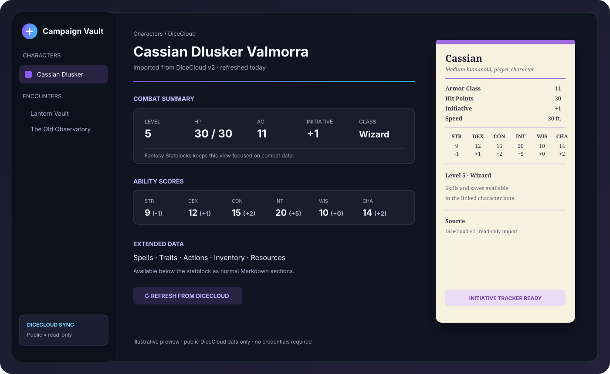
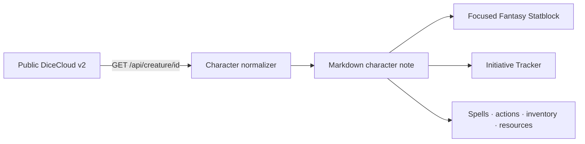

<div align="center">

# DiceCloud Character Importer

**Turn a public DiceCloud v2 character into a clean, combat-ready Markdown note.**

[](https://github.com/EnzoIP3/dicecloud-importer/releases)
[](./LICENSE)
[](https://community.obsidian.md/plugins/dicecloud-importer)

[Install from the Community directory](https://community.obsidian.md/plugins/dicecloud-importer) · [Report a bug](https://github.com/EnzoIP3/dicecloud-importer/issues) · [Request a feature](https://github.com/EnzoIP3/dicecloud-importer/issues)

</div>

<div align="center">

<br>
<sub>Illustrative preview: a readable character note, a focused combat statblock, and Initiative Tracker-ready data.</sub>
</div>

## Why this exists

DiceCloud is excellent at calculating character sheets. Markdown is excellent at keeping campaign notes close to the rest of the vault. This plugin connects the two without pretending that a player character is a monster.



## Features

| | | |
|---|---|---|
| **One-click import**<br>Paste a public URL or character ID. | **Combat summary**<br>HP, AC, initiative, level, abilities, skills and saves. | **Tracker-ready**<br>Add the current character to Initiative Tracker. |
| **Readable Markdown**<br>Keep extended character data in normal note sections. | **Safe refreshes**<br>Update from DiceCloud while preserving local current HP. | **No credentials**<br>Public read-only requests only. |

## Install

### Community directory

1. Open the [DiceCloud Character Importer page](https://community.obsidian.md/plugins/dicecloud-importer).
2. Click **Add to Obsidian** or install it from **Settings → Community plugins → Browse**.
3. Enable the plugin.

### Manual installation

Copy `main.js` and `manifest.json` into:

```text
<Vault>/.obsidian/plugins/dicecloud-importer/
```

Then enable **DiceCloud Character Importer** under **Settings → Community plugins**.

## Quick start

Open the command palette with `Ctrl+P` on Windows/Linux or `Cmd+P` on macOS, then run:

| Command | What it does |
|---|---|
| **Import public DiceCloud character** | Creates or updates a character note from a URL or ID. |
| **Refresh current note from DiceCloud** | Re-fetches the public sheet and preserves `current-hp`. |
| **Add current character to Initiative Tracker** | Adds the current PJ to an active tracker. |
| **Start Initiative Tracker encounter with current character** | Opens a new encounter with the current PJ. |

The default destination is `Characters/DiceCloud/`. Change it in the plugin settings.

## What the generated note contains

### Focused Fantasy Statblock

The statblock deliberately contains only the information useful at a glance during combat:

- HP and AC
- Initiative modifier
- Level and class
- Six ability scores
- Speed
- Skills and saving throws
- Source and image, when available

The statblock does **not** dump every DiceCloud feature, action, item or spell into the creature panel.

### Extended Markdown sections

The complete imported projection remains available below the statblock as normal Markdown:

- abilities and modifiers;
- skills and saving throws;
- spell DC, spell attack bonus and spell slots;
- spells;
- traits and class features;
- actions;
- inventory;
- synchronization metadata.

This keeps the bestiary view useful while preserving the information the DM may need between turns.

## Privacy and permissions

The importer only requests:

```text
GET https://dicecloud.com/api/creature/{characterId}
```

It does not request, store or transmit DiceCloud credentials. It never writes to DiceCloud. The plugin uses a small ID-to-note-path map for imported characters instead of scanning every file in the vault.

## Limitations

DiceCloud is a calculation engine with a rich property tree. Its automation, effects and formulas cannot be represented losslessly in a Fantasy Statblock. This plugin creates a practical projection for note-taking and combat rather than a second DiceCloud implementation.

Only **public** DiceCloud v2 characters are supported. DiceCloud v1 routes are not supported.

## Development

This plugin is intentionally small and ships as plain JavaScript; no build step is required.

```bash
git clone https://github.com/EnzoIP3/dicecloud-importer.git
cd dicecloud-importer
node --check main.js
```

Pull requests and issue reports are welcome.

## License

MIT. See [LICENSE](./LICENSE).

<div align="center">
<sub>Built for campaign notes, not another login screen.</sub>
</div>
